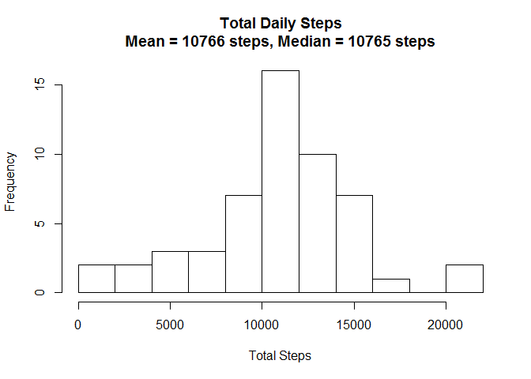
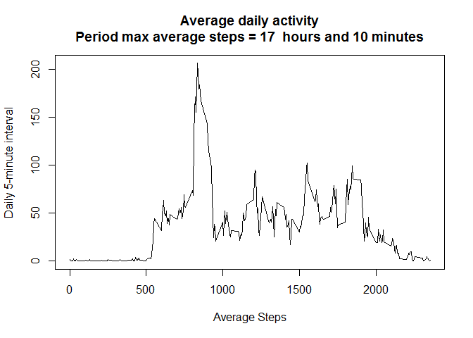
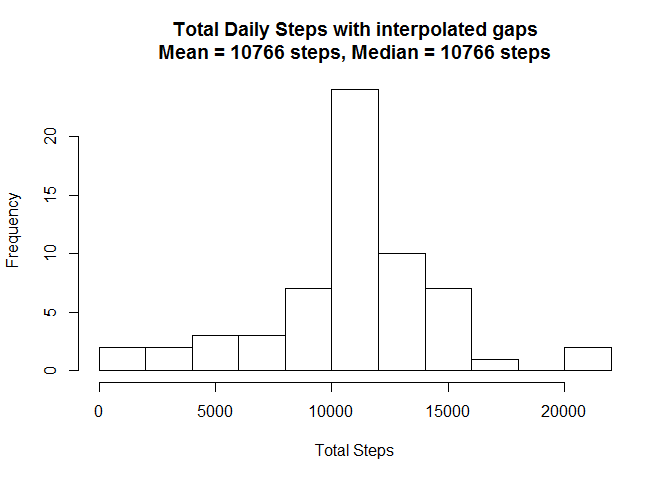

# Reproducible Research: Peer Assessment 1

## Introduction

It is now possible to collect a large amount of data about personal
movement using activity monitoring devices such as a
[Fitbit](http://www.fitbit.com), [Nike
Fuelband](http://www.nike.com/us/en_us/c/nikeplus-fuelband), or
[Jawbone Up](https://jawbone.com/up). These type of devices are part of
the "quantified self" movement -- a group of enthusiasts who take
measurements about themselves regularly to improve their health, to
find patterns in their behavior, or because they are tech geeks. But
these data remain under-utilized both because the raw data are hard to
obtain and there is a lack of statistical methods and software for
processing and interpreting the data.

This assignment makes use of data from a personal activity monitoring
device. This device collects data at 5 minute intervals through out the
day. The data consists of two months of data from an anonymous
individual collected during the months of October and November, 2012
and include the number of steps taken in 5 minute intervals each day.

## Data

The data for this assignment can be downloaded from:

* Dataset: [Activity monitoring data](https://d396qusza40orc.cloudfront.net/repdata%2Fdata%2Factivity.zip) [52K]

The variables included in this dataset are:

* **steps**: Number of steps taking in a 5-minute interval (missing
    values are coded as `NA`)

* **date**: The date on which the measurement was taken in YYYY-MM-DD
    format

* **interval**: Identifier for the 5-minute interval in which
    measurement was taken

The dataset is stored in a comma-separated-value (CSV) file and there
are a total of 17,568 observations in this
dataset.

## Loading and preprocessing data

```r
library(knitr)
```

```
## Warning: package 'knitr' was built under R version 3.1.3
```

```r
library(lubridate)
library(dplyr)
```

```
## 
## Attaching package: 'dplyr'
## 
## The following objects are masked from 'package:lubridate':
## 
##     intersect, setdiff, union
## 
## The following object is masked from 'package:stats':
## 
##     filter
## 
## The following objects are masked from 'package:base':
## 
##     intersect, setdiff, setequal, union
```

```r
library(lattice)

activity <- read.csv(unz("activity.zip","activity.csv"))

daily_activity <- activity %>%
group_by(date) %>%
summarize(total_steps = sum(steps)) %>%
filter(!is.na(total_steps)) 

interval_activity <- activity %>%
group_by(interval) %>%
summarize(mean_steps = mean(steps, na.rm = 1))

missing_values <- activity %>%
filter(!is.na(steps)) %>%
count()

activity_nogap <- activity
activity_nogap[is.na(activity$steps), "steps"] <- interval_activity$mean_steps

daily_nogap <- activity_nogap %>%
group_by(date) %>%
summarize(total_steps = sum(steps)) %>%
filter(!is.na(total_steps)) 

activity_weekpart <- activity_nogap %>%
mutate(is.weekend = factor( 
    (weekdays(ymd(date)) == "Saturday" | weekdays(ymd(date)) == "Sunday"),
    labels=c("weekday","weekend")))

interval_weekday <- activity_weekpart %>%
filter(is.weekend == "weekday") %>%
group_by(interval) %>%
summarize(mean_steps = mean(steps, na.rm = 1))

interval_weekend <- activity_weekpart %>%
filter(is.weekend == "weekend") %>%
group_by(interval) %>%
summarize(mean_steps = mean(steps, na.rm = 1))

interval_weekpart <- activity_weekpart %>%
group_by(interval, is.weekend) %>%
summarize(mean_steps = mean(steps, na.rm = 1))
```

## Mean total number of steps taken per day

```r
title <- "Total Daily Steps"
daily_mean <- as.integer(mean(daily_activity$total_steps))
daily_median <- as.integer(median(daily_activity$total_steps))
subtitle <- paste(
	"Mean =", daily_mean, "steps,",
	"Median =", daily_median,"steps")
hist(daily_activity$total_steps, 
	main = paste(title, subtitle, sep = "\n"),
	xlab = "Total Steps",
	breaks = 10)
```

 

## Average daily activity pattern

```r
title <- "Average daily activity"
max_period <- max(interval_activity$mean_steps) * 5
max_period_h <- as.integer(max_period / 60)
max_period_m <- as.integer(max_period %% 60)

subtitle <- paste(
    "Period max average steps =",
    max_period_h,
    " hours and",
    max_period_m,
    "minutes")
plot(x = interval_activity$interval, 
    y = interval_activity$mean_steps, 
    type = "l",
    main = paste(title, subtitle, sep = "\n"),
    xlab = "Average Steps",
    ylab = "Daily 5-minute interval")
```

 

## Imputing missing values

```r
title <- "Total Daily Steps with interpolated gaps"
nogap_mean <- as.integer(mean(daily_nogap$total_steps))
nogap_median <- as.integer(median(daily_nogap$total_steps))
subtitle <- paste(
	"Mean =", nogap_mean, "steps,",
	"Median =", nogap_median,"steps")
hist(daily_nogap$total_steps, 
	main = paste(title, subtitle, sep = "\n"),
	xlab = "Total Steps",
	breaks = 10)
```

 

The number of missing values is 15264 but we can replace them
with the average for the corresponding interval. After filling the gaps
the mean daily steps stays the same at 10766 = 10766, and
the median daily steps has a very small change from 10765 to 10766

## Differences in activity patterns between weekdays and weekends

```r
title <- "Activity patterns on weekdays and weekends"
print(xyplot(interval_weekpart$mean_steps ~ interval_weekpart$interval | interval_weekpart$is.weekend, 
type="l", 
layout = c(1, 2),
xlab = "Interval",
ylab = "Number of Steps"
))
```

 
